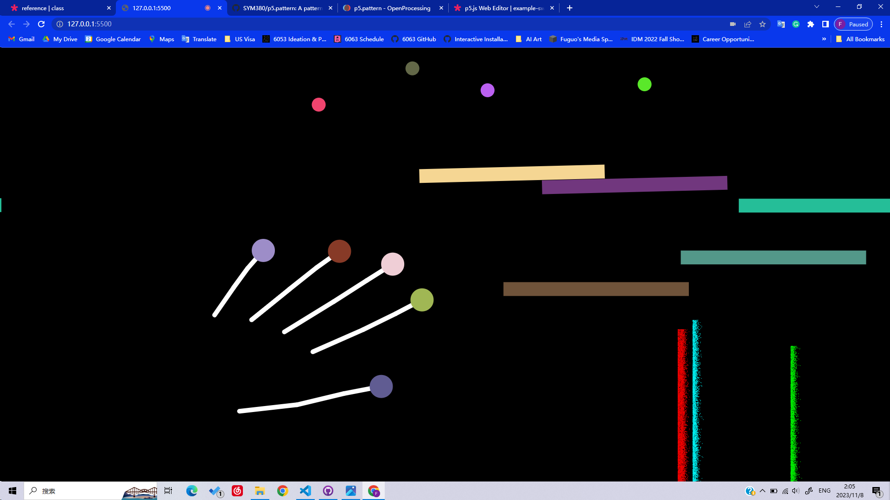
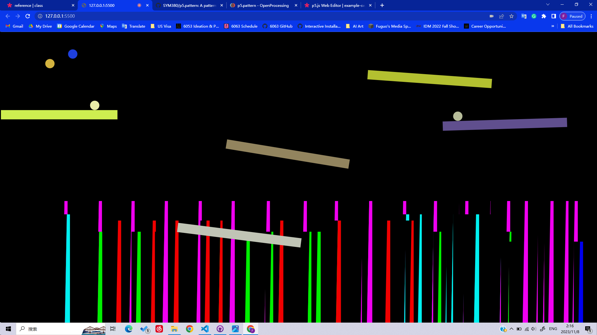
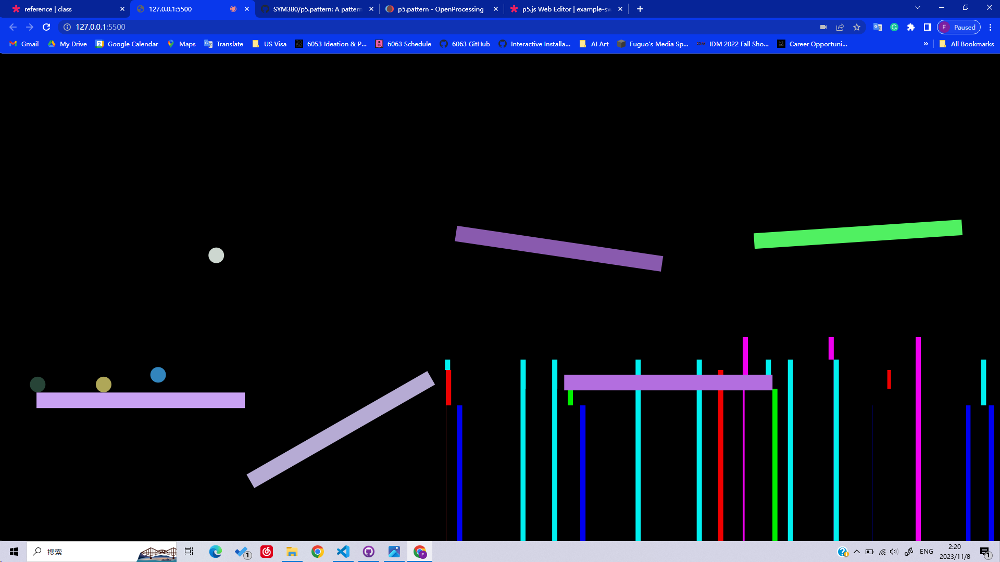
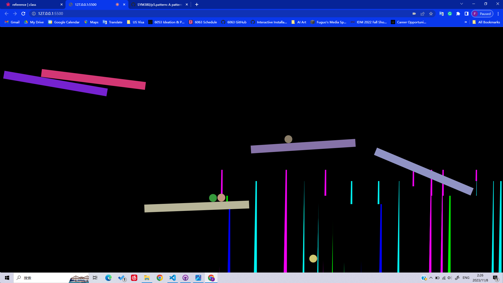
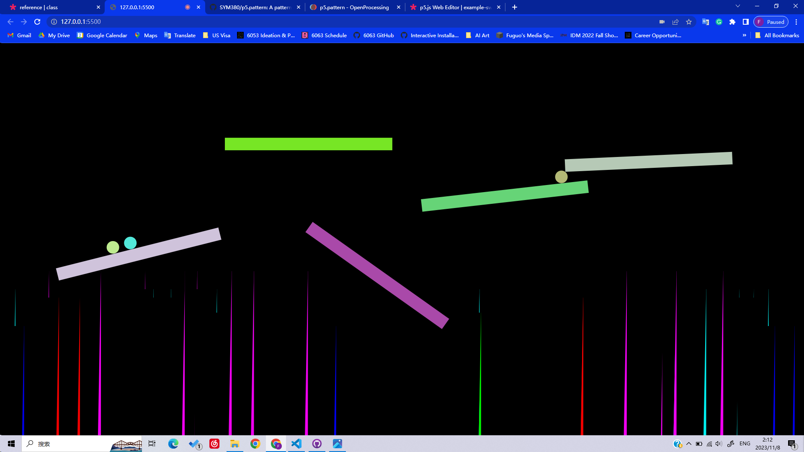
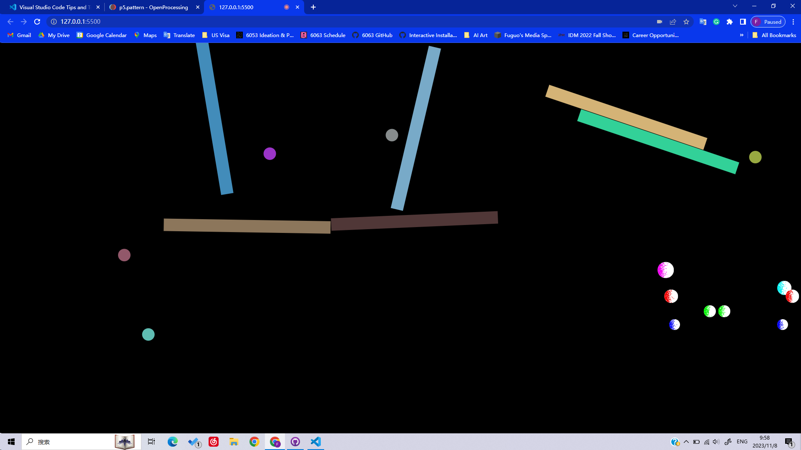
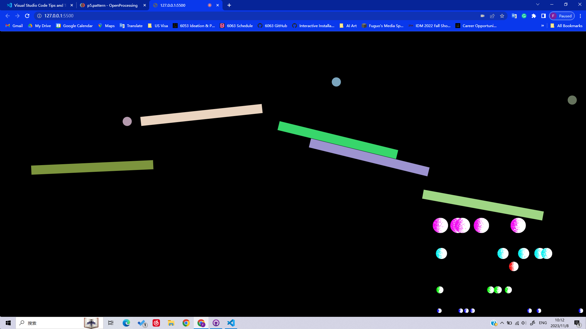

# HW09 Notes
This week, I explored many p5.js libraries and used some of them to create a MIDI music generation game. Below are some libraries I explored: 

* **[ml5.js](https://learn.ml5js.org/#/)**: I used it for hand pose detection. 
* **[p5.Polar](https://github.com/liz-peng/p5.Polar)**: I didn't use it but find it interesting and convenient to create polar patterns. 
* **[p5Play](https://p5play.org/index.html)**: I used it to create the game mechanism. 
* **[p5.sound](https://p5js.org/reference/#/libraries/p5.sound)**: I used it to make MIDI notes. 
* **[p5.pattern](https://openprocessing.org/sketch/1278485)**: I used it to color the circles generated in real-time. 

To play the game: 

1. Move the blocks on the screen to the positions and angles you want by waving your hands in front of your camera. Your fingertips (marked as circles on the screen) are able to push the blocks around. 
2. Press "s" key to start the game. There will be balls dropping down from the top of the screen. When they collide with the blocks, you will hear MIDI notes.
3. If a block is too near to the edge of the screen, it will be disabled and start to fall down. Following the disabling of that block, a new block will be generated at a random position. 
4. If you want to adjust the positions of the blocks, press "p" key to pause the game. 

## How I used the libraries
### [p5Play](https://p5play.org/index.html)
When learning p5Play, I think it is useful for creating simple games. I have experience with Unity game development, and I found many game-related functions in this library, such as bounciness and velocity. Therefore, I plan to make a simple game with the p5Play library. Below is a sketch of my initial idea, which is a digital sandbox for the player to move everything inside around by waving their hands in front of the camera. 

*[sandbox sketch]

Upon learning the collision function in p5Play, I think I can make something similar to [Sketch Piston - Playing Music](https://www.teamlab.art/w/playingmusic/) by teamLab. The high-level logic is to make notes or sound effects upon collisions between elements. Therefore, I used the `collided()` function in p5Play library to detect collisions between blocks and balls, and used p5.sound library to make a MIDI note upon every collision. For the interaction, I used the ml5.js library to detect the player's hand so that the player can use their hand to push the blocks on the screen. 

*[sandbox ver 2]

### [ml5.js](https://learn.ml5js.org/#/)
Since I'm interested in computer vision, I explored several functions and examples provided by the ml5.js library. I explored BodyPix, PoseNet, Facemesh, and Handpose. To make the interaction easier for the player, I decided to adapt the Handpose example. 

When testing the example of Handpose with my sandbox, I found that too many key points of my hand can be a problem: it was easy for my hands to accidentally touch the elements. Therefore, I decided to draw five lines that matched my five fingers to see if it could make the interaction less messy. However, I found that I cannot push things around with lines by using p5Play. I guess it is because different from shapes like rectangles and circles, a line has no area, thus no mass assigned to it by p5Play. Therefore, I changed my plan to just drawing a circle at my fingertips. This adjustment makes it easier for me to move the blocks around, and it is intuitive because people generally are used to touching things with their fingertips. When playing the game, I can also change the trajectory of the falling balls by colliding my fingertips with them. 

To prevent lags during runtime, I also resized the video input from 640\*480 to 160\*120 before hand pose tracking. The 160\*120 size is good enough for recognizing hand pose, and it requires less computational resources to load the video. In this way, the program becomes smoother when running. 

### [p5.sound](https://p5js.org/reference/#/libraries/p5.sound)
When designing this game, I learned how to make MIDI notes with p5.sound library. I referred to [this](https://p5js.org/examples/hello-p5-song.html) example on p5.js website. I also referred to [this](https://www.inspiredacoustics.com/en/MIDI_note_numbers_and_center_frequencies) website for MIDI note numbers and their frequencies. The real-time

### [p5.pattern](https://openprocessing.org/sketch/1278485)
I also explored p5.pattern. Different from other libraries, this library requires me to download its JS file and put it in the directory of my sketch. Other than that, this library is easy to use. 

I tried different patterns to color the circles generated in real-time when MIDI notes are played, and I found that some of them will make the lag during runtime more serious. For example, when I draw rectangles in a noise gradient pattern, the program becomes quite laggy. 

Therefore, I tried to use other simpler patterns like strips to color the rectangles, which indeed enabled the program to run with less lagging. 

I also tried to change the shapes from rectangles to circles. Maybe due to the smaller area of a circle to render compared with a rectangle in my program, this change produces even less lagging. Therefore, I decided to use circles instead of rectangles. 

To make the circles spread on the canvas more evenly, I used the `map()` function to map their positions and sizes. 

## Challenges
* I didn't figure out how to use the p5Play and p5.pattern libraries together. I wanted to create the blocks in one of the preset patterns in p5.pattern, but the two libraries have different syntaxes for creating a rectangle.
* Since these libraries are created by others, I need to first go through the documentation or the tutorials to learn about what functions or classes I can use.
* Although I can easily implement ml5.js in my program, it is hard to make it run smoothly in the browser. After consulting, I learned that it is due to many reasons, such as the framerate of the browser, the framerate of my screen, and the nature of JavaScript language. Therefore, p5.js programs should be considered as prototypes, not the final digital product to deliver. However, I still find the ml5.js library useful as it makes computer vision much easier to implement on a browser. 
